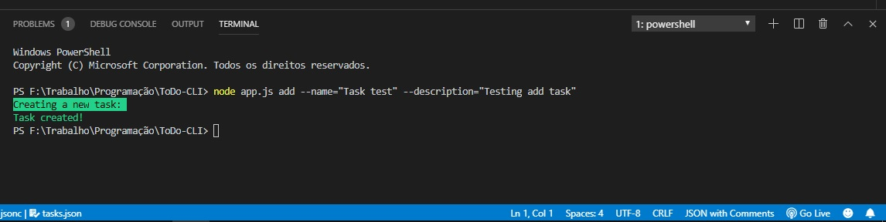

# ToDo-CLI
<blockquote>A ToDo list CLI app made with Node.js</blockquote>

<h2>Functions</h2>
<h3>Add<h3>
  
 <h6>Using the add command and inputing the task name and task description, you can save a task into the app.</h6>
